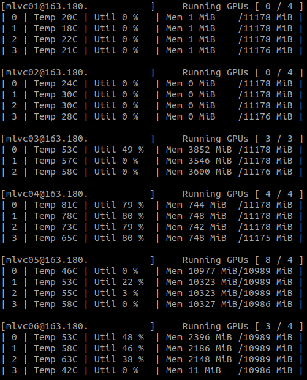

# kairos-smi
Multi-server gpu monitoring program  

[](https://badge.fury.io/py/ksmi)

See change Log: [change log](change_logs/v0.1.3.1.md)



```
usage: ksmi [-h] [-l] [-c CONFIG]

optional arguments:
  -h, --help            show this help message and exit
  -l, --loop            loop forever
  -c CONFIG, --config CONFIG
                        set config file location
```

# quick start
## 1. install 
Install with pip
```shell
$ pip install ksmi
or
$ pip3 install ksmi
```

## 2. Setup config file
Edit `config.json`. Add your gpu server address in `config.json`.
```json
{
	"hosts": [
		"<username>@<host>[:port]",
		"<username>@<host>[:port]"
	]
}
```

## 3. Add rsa_id to server

create new rea_id and add to your server

```shell
$ python3 -m ksmi.copy_id -c config.json -n
```

## 4. Run It!
```shell
$ python3 -m ksmi -c config.json -l
```

# kairos-smi
```
usage: kairos_smi.py [-h] [-l] [-c CONFIG]

optional arguments:
  -h, --help            show this help message and exit
  -l, --loop            loop forever
  -c CONFIG, --config CONFIG
                        set config file location
```

### Simple usage
Run once
```
$ python3 -m ksmi -c config.json
```

Run forever
```
$ python3 -m ksmi -c config.json -l
```

# utils
## copy_id
```
usage: copy_id.py [-h] [-n] [-c CONFIG] [-s SERVER]

optional arguments:
  -h, --help            show this help message and exit
  -n, --new_id          generate new id_rsa key
  -c CONFIG, --config CONFIG
                        set config file to use host list
  -s SERVER, --server SERVER
                        set a server to copy id
```

## copy id(rsa) to server

### Use with `config.json`
```
$ python3 -m ksmi.copy_id -c config.json
or
$ python3 -m ksmi.copy_id --config config.json
```

### Use with individual Server address
```
$ python3 -m ksmi.copy_id -s [username@]<IP>[:port]
or
$ python3 -m ksmi.copy_id --server [username@]<IP>[:port]
```

### Make a new id_rsa 
```
$ python3 -m ksmi.copy_id -n
or
$ python3 -m ksmi.copy_id --new_id
```
