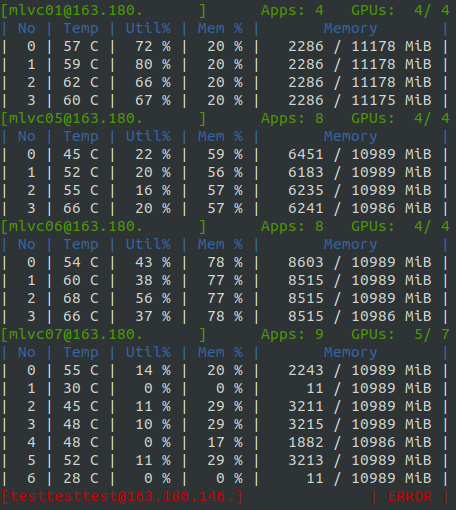

# Version 0.2.2
**v0.2.2a1: august 29**

---
Welcome to v0.2.2 version of Ksmi. There are a number of updates in theis version.
 - [UI update](#ui-update) - new mordern ui and colorful mode.
 - [Defatult Loop option](#default-loop-option) - now we don't support single run.

## UI update
User Interface is updated with mordern colorful using `curses` module.  
Working servers display as `Green` and Error servers display as `Red` with `ERROR`.

## Default Loop option
As new UI update, We delete **loop option** used as `-l` or `--loop`.
Now loop is default, We do not support singe execution.

## Notable fixes
- [17](https://github.com/kairos03/kairos-smi/issues/17): Result Key error when get gpu status.

## Thank you
contributions to `ksmi`: 
- [doublejtoh(@doublejtoh)](https://github.com/doublejtoh): 
  - several feature request [#3](https://github.com/kairos03/kairos-smi/issues/3). 
  - get more specific app information and display [#11](https://github.com/kairos03/kairos-smi/pull/11).
- [KHLee(@2KangHo)](https://github.com/2KangHo): bug report [#17](https://github.com/kairos03/kairos-smi/issues/17).
- [Abdul Muqeet(@AM1ALI)](https://github.com/AM1ALI): fix typo `moniroting` to `monitoring` in README.md