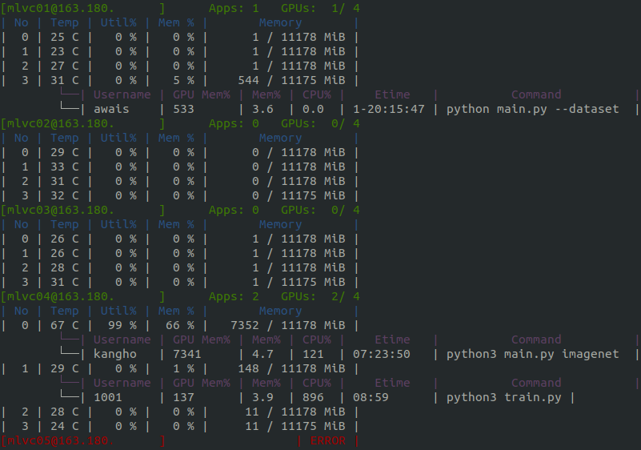

# Version 0.2.2
**v0.2.2a1: august. 29. 2019.**  
**v0.2.2a2: september. 02. 2019.**

Download: [python3](https://pypi.org/project/ksmi/0.2.2a2/)

---
Welcome to v0.2.2 version of Ksmi. There are a number of updates in theis version.
 - [UI update](#ui-update) - new mordern ui and colorful mode.
 - [Defatult Loop option](#default-loop-option) - now we don't support single run.
 - [Process Option](#process-option) - new feature! now we can see which processes are running on gpu.
 - [User Option](#user-option) - new feature! now we can filter by user.

## UI update
User Interface is updated with mordern colorful using `curses` module.  
Working servers display as `Green` and Error servers display as `Red` with `ERROR`.

## Default Loop option
As new UI update, We delete **loop option** used as `-l` or `--loop`.
Now loop is default, We do not support singe execution.

## Process Option

`-p` or `--process` option shows the details of all the running processes as below.
- username
- gpu memory usage %
- memory usage %
- cpu usage %
- execution time
- command

## User Option

`-u` or `--user` option only the running processes with the specified <b>username</b>.

e.g. `ksmi -u foo` finds the running processes of the owner name **"foo"**

## Notable fixes
- [17](https://github.com/kairos03/kairos-smi/issues/17): Result Key error when get gpu status.

## Thank you
contributions to `ksmi`: 
- [doublejtoh(@doublejtoh)](https://github.com/doublejtoh): 
  - several feature request [#3](https://github.com/kairos03/kairos-smi/issues/3). 
  - get more specific app information and display [#20](https://github.com/kairos03/kairos-smi/pull/20) [#21](https://github.com/kairos03/kairos-smi/pull/21).
- [KHLee(@2KangHo)](https://github.com/2KangHo): bug report [#17](https://github.com/kairos03/kairos-smi/issues/17).
- [Abdul Muqeet(@AM1ALI)](https://github.com/AM1ALI): fix typo `moniroting` to `monitoring` in README.md
